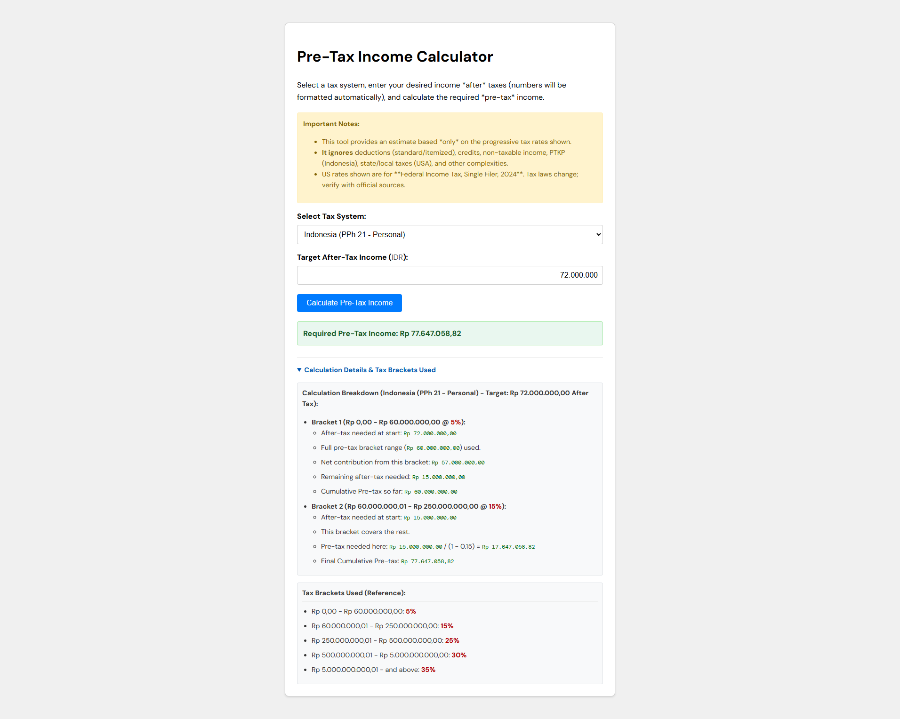

# Pre Tax Calculator

This is a simple calculator that calculates how much the pre tax income amount needed to generate n amount of after-tax income. There's so many income tax calculators out there already, but not many of them provide a simple and deterministic way to calculate pre-tax income. Hope this app helps your financial planning.

## How to use

1. Select what tax bracket to use (currently available: Pajak Penghasilan Indonesia PPh 21, and USA Federal Income Tax Single Filer 2024)
2. Input the amount of after-tax income that you want to generate
3. Click calculate
4. The calculator will display the pre tax amount needed to generate the after-tax income along with the detailed calculation steps

## Example

Let's say you want to generate $100,000 after-tax income. You can use the calculator to find out how much pre-tax you need to generate that amount.

## Features to be added

- Add more tax brackets
- Add tax deductions (PTKP, Tanggungan, etc.)

## Built With

- HTML
- CSS
- JavaScript
